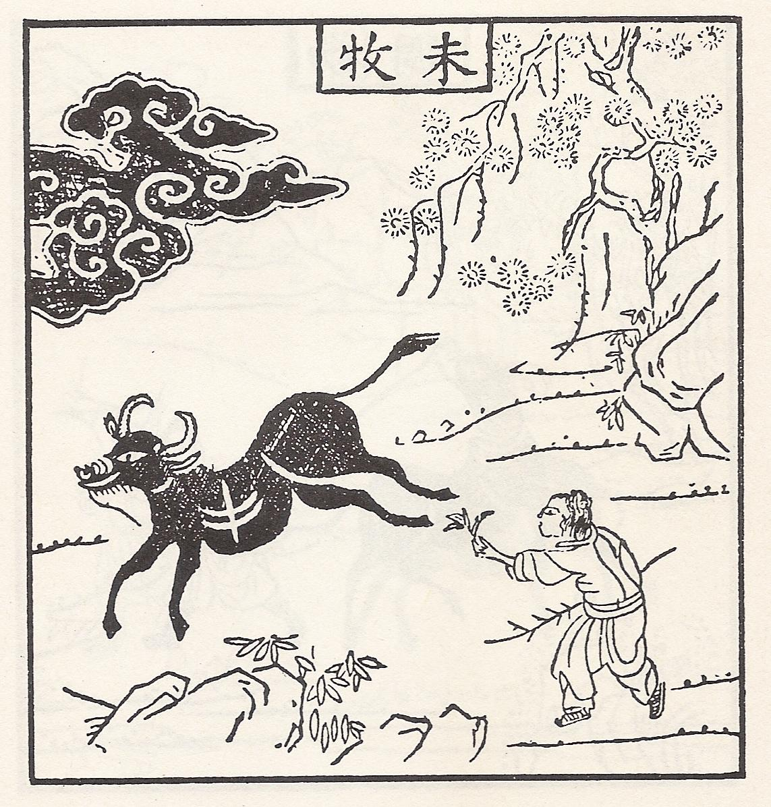
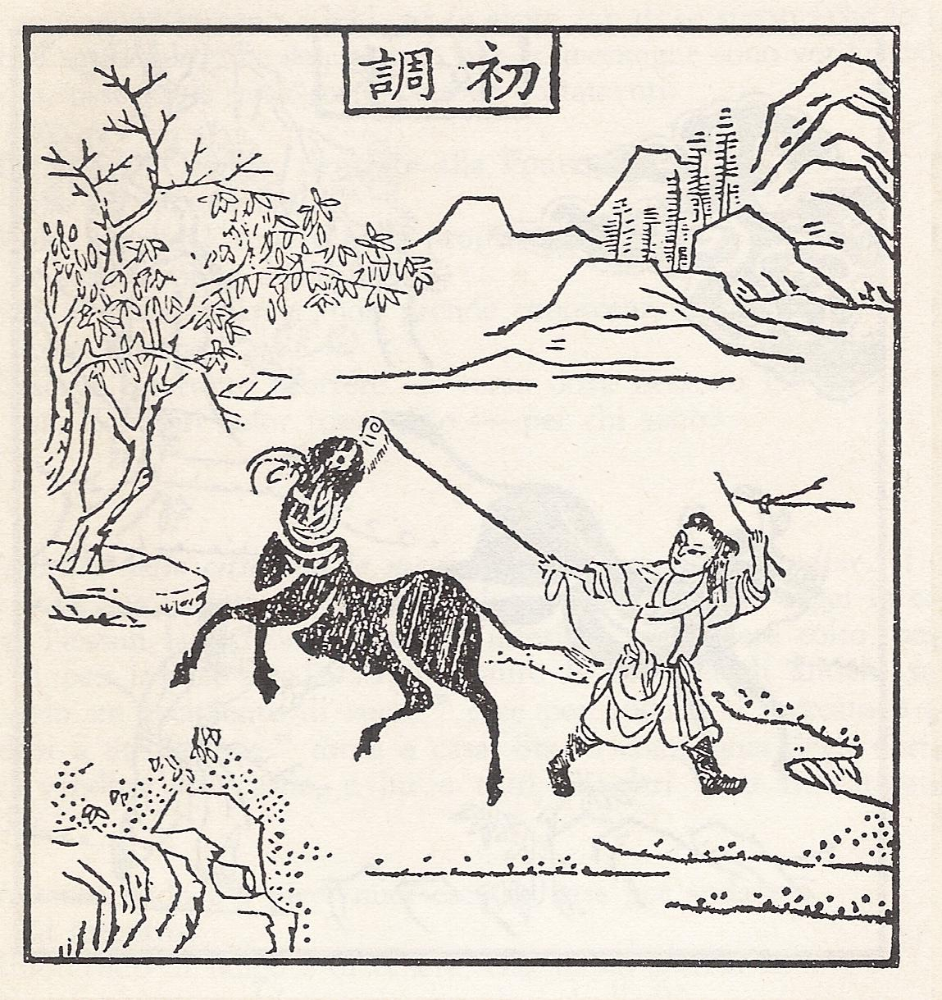
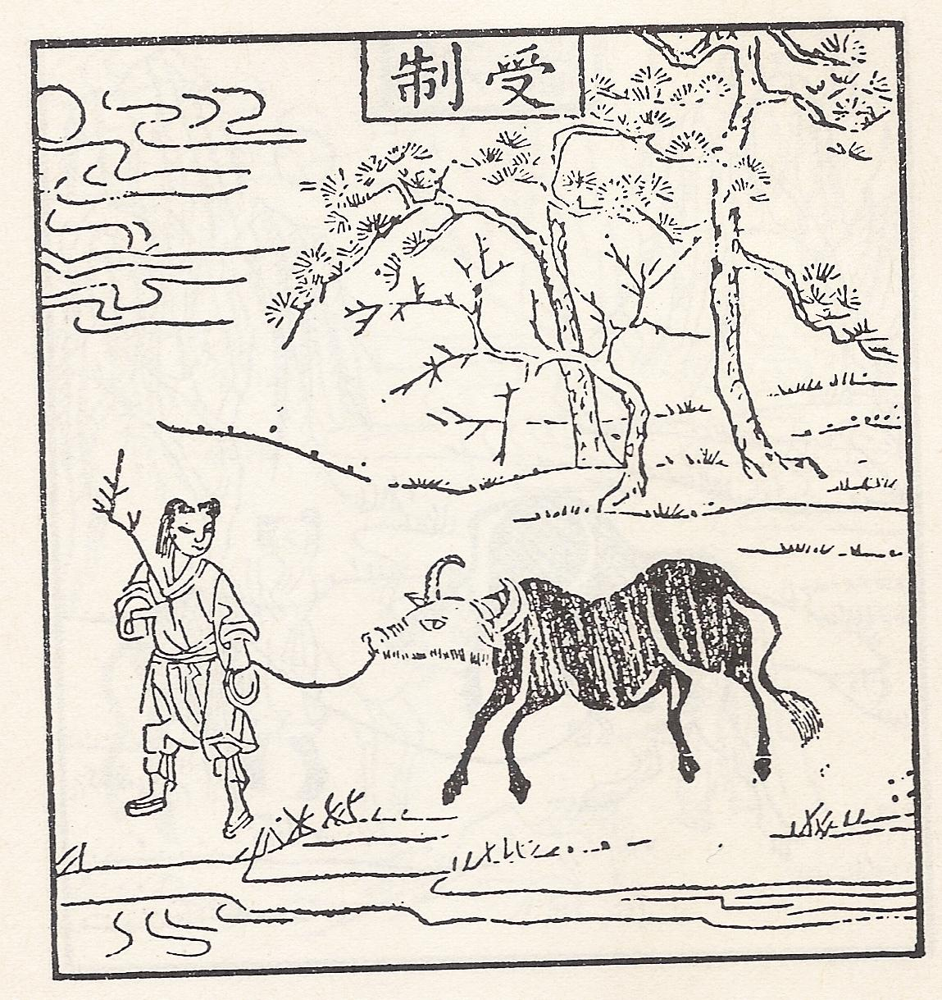
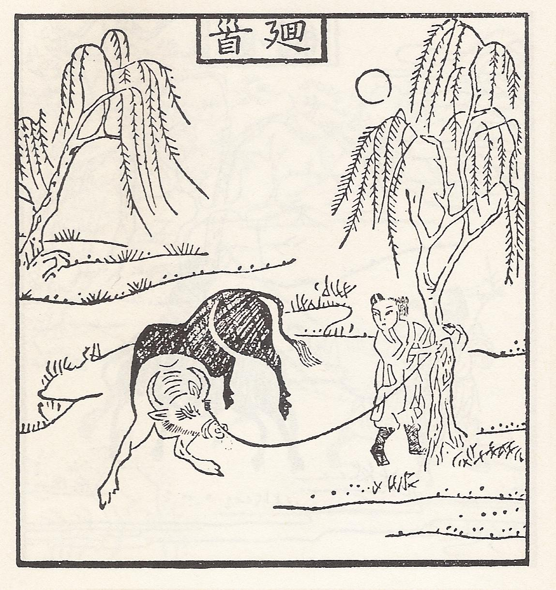
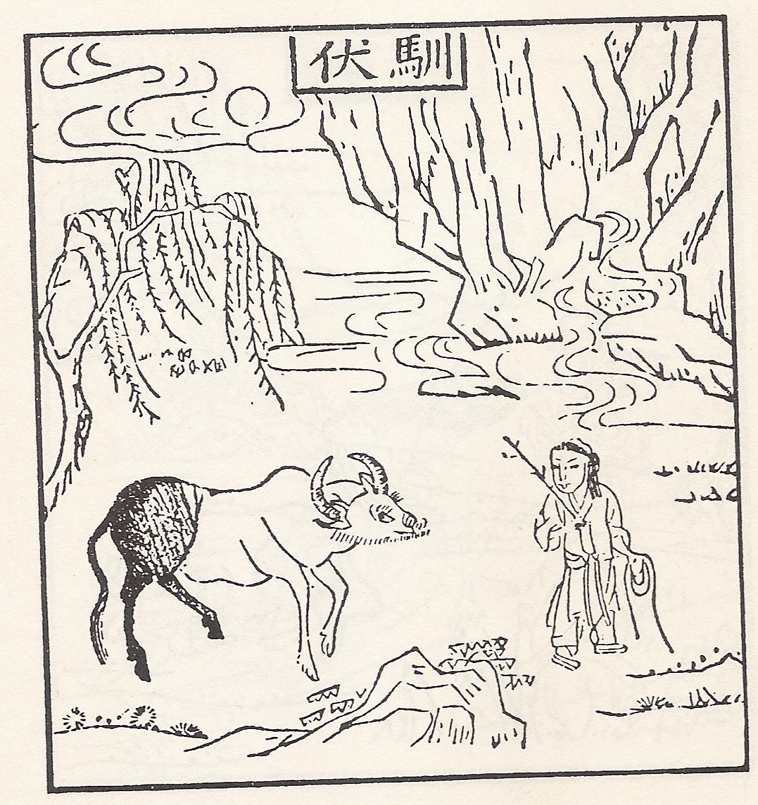
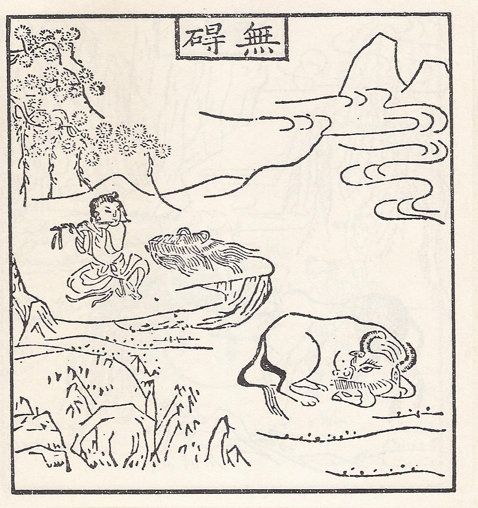
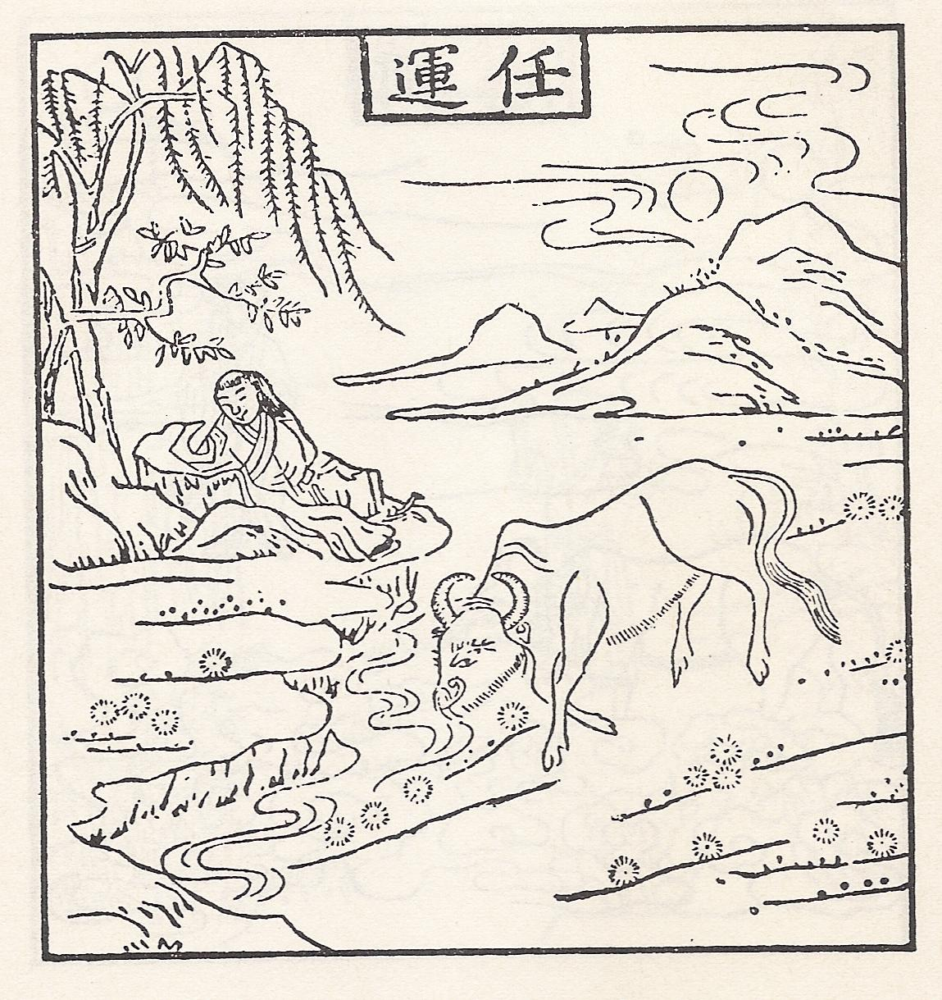
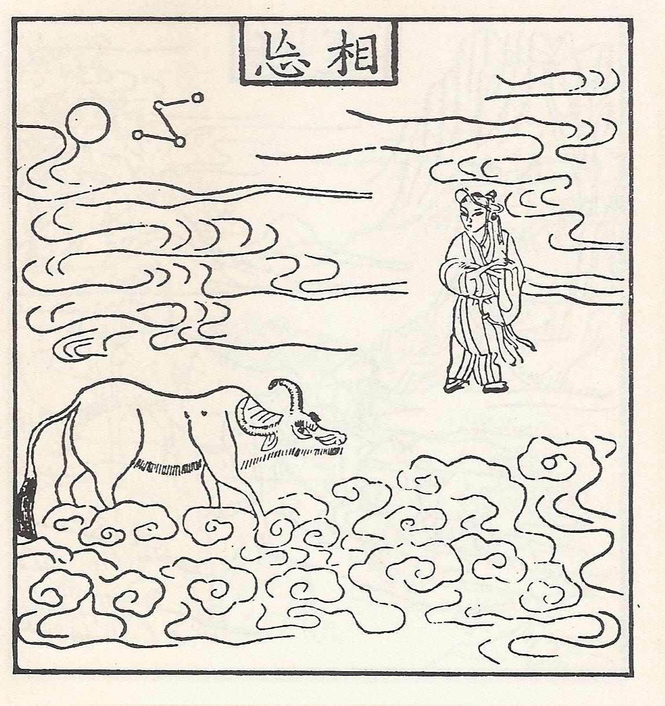
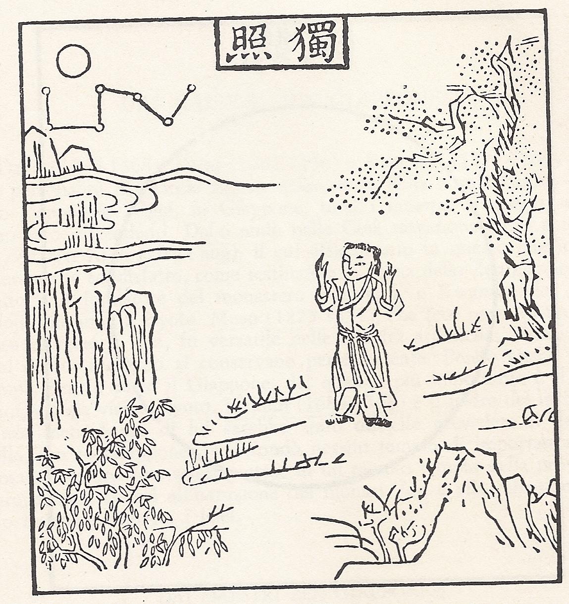
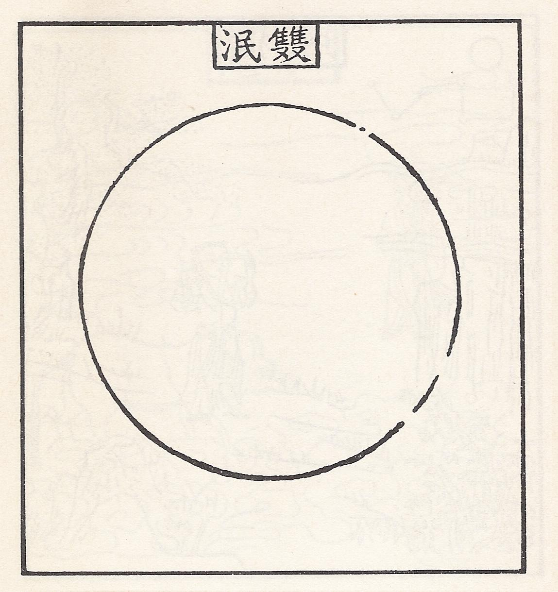

+++
date = '2026-02-20T10:59:04+01:00'
title = "Le Dieci Immagini della Caccia al Bue"
subtitle = 'Canto della Meditazione e il Sutra del Diamante'
summary = "Le Dieci Immagini della Caccia al Bue descrivono in forma simbolica il cammino della disciplina zen: dalla ricerca smarrita della propria natura, attraverso la scoperta, la lotta, il dominio della mente e il superamento del dualismo, fino al ritorno all'origine e alla presenza libera e compassionevole nel mondo. Il Canto della Meditazione di Hakuin e il Sutra del Diamante approfondiscono questo itinerario mostrando che la verità, il Buddha e l'illuminazione non sono realtà esterne da possedere, ma coincidono con il distacco, la non-dualità e il risveglio del Sé."
tags = [
    "zen",
    "bue",
    "mente",
    "ricerca",
    "tracce",
    "disciplina",
    "vuoto",
    "origine",
    "illuminazione",
    "beatitudine",
]
categories = ['zen']
author = 'Kaku-an'
+++

# La caccia al Bue

Sembra che l'autore di queste *Dieci immagini della caccia al Bue* sia stato un maestro della dinastia Sung di nome *Kaku-an Shi-en* della scuola Rinzai. Non fu però il primo a cercare di illustrare per mezzo di immagini gli stadi della disciplina Zen, perché nella prefazione generale alle immagini si richiama ad un altro maestro Zen di nome *Seikyo*.

Nel caso delle icone di *Seikyo* lo sviluppo graduale della vita Zen era indicato da un progressivo *sbiancamento* dell'animale e terminava con la sua completa scomparsa. Usava solo **5** immagini rispetto alle **10** del maestro *Kaku-an*.

*Kaku-an* pensò che questo avrebbe potuto in qualche modo ingannare, perché un cerchio vuoto veniva ad essere la *meta* della disciplina Zen: qualcuno avrebbe potuto considerare il vuoto come importante e definitivo. Da qui la sua estensione che risultò nelle **10** immagini che abbiamo oggi.

Secondo un commentatore delle immagini del maestro *Kaku-an* c'è un'altra serie di immagini disegnate dal maestro *Jitoku Ki*, che sembra aver conosciuto le **5** immagini di *Seikyo* perché le sue sono **6**. L'ultima, la sesta, oltrepassa lo stadio del vuoto assoluto in cui terminano quelle di *Seikyo*, terminando con questa poesia:

> Ancora oltre il limite estremo c'è un passaggio,  
> da cui egli ritorna nei sei regni dell'esistenza;  
> tutte le cose di questa terra sono opere buddhiste;  
> dovunque va egli trova la stessa aria.  
> Come una gemma sta, anche nel fango,  
> come oro risplende, anche in un forno.  
> Lungo la strada senza fine della nascita e della morte,  
> egli cammina, sufficiente in se stesso,  
> e con chiunque si trovi si muove con facilità  
> e senza attaccamento.

Anche il Bue di *Jitoku* diventa sempre più bianco, come quello di *Seikyo*, e in questo si differenziano entrambi dalla concezione di *Kaku-an*.

In Cina sembra esser stata in uso un'altra edizione, che apparteneva alla serie di immagini simili a quelle di *Seikyo* e *Jitoku*. L'autore è sconosciuto ed anche questa serie è composta da **10** immagini, in cui il colore del Bue *cambia secondo il comportamento del guardiano rispetto ad esso*: le antiche stampe cinesi sono riprodotte più avanti, insieme ai rispettivi versi del poeta *Pu-ming*.

---

## I. In cerca del Bue

L'animale non si è mai smarrito: a cosa serve allora cercarlo? Se non ha più rapporti col mandriano è perché il mandriano stesso ha violato la propria natura più intima. L'animale si è perduto perché il pastore è stato portato fuori strada dalle illusioni dei sensi, si è allontanato dalla sua casa, e bivi e scorciatoie sono sempre più confusi. Il desiderio del guadagno e la paura della perdita bruciano come il fuoco, le idee di giusto e sbagliato colpiscono come le frecce di un esercito:

> Solo nel deserto, perduto nella giungla, il ragazzo è in cerca, in cerca!  
> Le acque sono increspate, le montagne lontane e il sentiero senza fine;  
> Stanco e depresso, non sa dove andare, e ascolta le cicale della sera che cantano nel boschetto d'aceri.

*Senza disciplina: con le corna fieramente protese nell'aria, la bestia sbuffa, e correndo follemente sui sentieri delle montagne si allontana sempre di più!*

*Una nuvola scura si stende all'entrata della valle, chissà quanta erba sottile è calpestata sotto i suoi zoccoli!*

## II. La visione delle tracce

Con l'aiuto dei *sutra* e lo studio della dottrina è riuscito a capire qualcosa e ha ritrovato le tracce. Adesso sa che i vasi, per quanto differenti, sono tutti d'oro e che il mondo oggettivo non è che un riflesso del *Sé*. Ma non riesce a distinguere ciò che è buono da ciò che non lo è, e la sua mente è confusa per ciò che riguarda il vero e il falso. Non avendo ancora oltrepassato il cancello, si dice che per adesso ha visto le tracce:

> Le tracce dell'animale perduto sono accanto al ruscello e sotto gli alberi;  
> Le erbe dal dolce profumo crescono fitte, ha forse trovato la Via?  
> Per quanto lontano sulla collina l'animale possa vagare, il suo naso raggiunge i cieli e nessuno può nasconderlo.

*L'inizio della disciplina: io ho una corda di paglia e la faccio passare attraverso il suo naso; per una volta tenta disperatamente di fuggire, ma è frustato severamente. L'animale resiste all'ammaestramento con tutta la forza che c'è nella sua natura selvaggia e incontrollata, ma il rustico pastore non allenta mai il tiro della sua catena e tiene la frusta sempre pronta.*

## III. La visione del Bue

Il ragazzo trova la Via ascoltando un suono e seguendolo; osserva così l'origine delle cose e i suoi sensi sono in ordine armonioso. In tutte le sue attività questo suono è presente e si manifesta. È come il sale dell'acqua e la colla del colore: *c'è, anche se non può distinguersi come entità individuale*. Quando volgerà l'occhio nella giusta direzione, capirà che non è altro che se stesso:

> Su di un alto ramo si posa un usignolo che canta allegramente;  
> Il sole è caldo e soffia una fresca brezza, sulla riva i salici sono verdi;  
> Il Bue è là, tutto solo, senza nascondersi;  
> La splendida testa decorata da corna maestose: quale pittore può ritrarla?

*Imbrigliato: a poco a poco imbrigliato, l'animale è adesso contento di essere condotto per il naso: attraversando i fiumi e camminando sui sentieri della montagna segue ogni passo della sua guida. Il pastore tiene la corda stretta nella mano senza mai lasciarla, tutto il giorno sta all'erta quasi senza accorgersi di che fatica sia.*

## IV. La cattura del bue

Perduto da tanto tempo nel deserto, il ragazzo ha finalmente trovato il bue e ha le mani su di lui. Ma, per l'insopportabile pressione del mondo esterno, il bue è difficile da tenere sotto controllo. Rimpiange continuamente il pascolo profumato: la sua natura selvaggia è ancora indocile e rifiuta di essere domata. Se il mandriano vuole tenere il bue in perfetta armonia con sé, deve usare liberamente la frusta:

> Con tutta la sua energia, il ragazzo ha finalmente catturato il bue;  
> ma com'è selvaggia la sua volontà, com'è indomabile la sua forza!  
> A volte passeggia su una radura,  
> e, guarda! Si è perso di nuovo su un valico nebbioso impenetrabile.

*Fronteggiato: dopo lunghi giorni di disciplina i risultati iniziano a vedersi e l'animale è fronteggiato: la sua natura selvaggia e incontrollata è finalmente domata, ed è diventato docile. Ma il mandriano non si fida completamente e tiene ancora la corda di paglia con cui il bue è legato ad un albero.*

## V. Portando il bue al pascolo

Quando un pensiero si muove, un altro viene appresso e poi un altro ancora: e così si forma una catena di pensieri. Con l'illuminazione tutto questo diventa verità: la falsità si afferma solo quando prevale la confusione. Se le cose ci opprimono la ragione non è nel mondo oggettivo, ma nella mente che inganna se stessa. Non lasciate la corda lenta: tenetela tesa e non permettete esitazioni.

> Il ragazzo non deve separarsi dalla frusta e dalla catena,  
> perché l'animale andrebbe a vagare in un mondo di contaminazioni.  
> Quando sarà guidato in modo giusto, crescerà puro e docile:  
> senza catene e senza legami, lui stesso seguirà il pastore.

*Domato: sotto i verdi salici e accanto al vecchio ruscello della montagna, il bue è messo in libertà di fare quel che vuole. A sera, quando la nebbia scende sul pascolo, il ragazzo prende la via verso casa e l'animale lo segue tranquillo.*

## VI. Ritorno a casa sul dorso del bue

La battaglia è finita, l'uomo non si interessa più di guadagno e perdita. Sussurra un motivo rustico degli uomini dei boschi e canta le semplici canzoni dei ragazzi di campagna. Mentre cavalca sul dorso del bue, i suoi occhi non sono fissi sulle cose terrene. Se qualcuno lo chiama, non si volta: per quanto tentato, nulla lo tirerà mai indietro.

> A cavallo dell'animale, torna tranquillamente verso casa;  
> avvolto nella nebbia della sera, com'è bello il suono del flauto che svanisce lontano!  
> Cantando un motivo rustico e armonioso, ha il cuore pieno di gioia indescrivibile.  
> C'è bisogno di dire che è uno di quelli che sanno?

*Slegato: sul campo verdeggiante l'animale passa il suo tempo ed è felice, non c'è bisogno della frusta adesso, né di qualsiasi controllo. Anche il ragazzo siede tranquillo sotto l'albero di pino, suonando una melodia di pace e traboccando di gioia.*

## VII. Il bue dimenticato lascia l'uomo da solo

I dharma sono uno e il bue è simbolico. *Quando capirai che ciò che ti serve non è la trappola o la rete, ma il coniglio o il pesce*, sarà come separare l'oro da un metallo o come la luna che esce dalle nuvole. L'unico raggio di luce sereno e penetrante risplende già da prima dei giorni della creazione:

> A cavallo dell'animale finalmente è tornato a casa,  
> e, guarda! Il bue non c'è più: l'uomo siede da solo ed è sereno.  
> Anche se il sole infuocato è alto nel cielo, sta ancora sognando tranquillo;  
> sotto un tetto coperto di paglia la frusta e la catena stanno a terra e non servono più.

*Indisturbato: nel sole della sera il ruscello di primavera scorre lentamente lungo la riva costeggiata dai salici: nell'atmosfera nebbiosa l'erba del prato cresce fitta. Quando ha fame pascola, quando ha sete beve, e il tempo scivola dolcemente; il ragazzo sulla roccia passa le ore sonnecchiando senza notare nulla di ciò che accade intorno a lui.*

## VIII. Il bue e l'uomo entrambi svaniti

Tutte le confusioni sono messe da parte e la serenità regna indisturbata: non c'è neppure un'idea di santità. Non indugia dove non c'è il *Buddha*, e dove c'è il *Buddha* si allontana velocemente. Quando non esistono forme di dualismo, neanche mille occhi riescono a percepire il foro di un occhiello. La santità davanti alla quale gli uccelli offrono dei fiori non è che una farsa.

> Tutto è vuoto: la frusta, la corda, l'uomo e il bue.  
> Chi può contemplare la vastità dei cieli?  
> Su di un forno che brucia ed è in fiamme, neanche un fiocco di neve può cadere:  
> quando le cose stanno così, lo spirito del vecchio maestro è presente.

*Tutto dimenticato: la bestia è adesso tutta bianca ed è circondata dalle nuvole bianche, l'uomo è perfettamente a suo agio e libero da preoccupazioni, come il suo compagno. Le bianche nuvole penetrate dalla luce della luna proiettano in basso le ombre. Le bianche nuvole e la luce della luna: ognuna segue la propria via e il proprio movimento.*

## IX. Ritorno all'origine, rientro alla fonte

Sin dall'inizio puro e immacolato, l'uomo non è stato colpito dalla contaminazione. Osserva la crescita delle cose mentre dimora nell'immobile serenità della *non-affermazione*. Non si identifica con le trasformazioni a maya che avvengono intorno a lui, né fa alcun uso di se stesso che lo renderebbe artificiale. Le acque sono blu, le montagne sono verdi. Seduto da solo, osserva le cose sottoposte ai mutamenti:

> Tornare all'Origine, rientrare alla Fonte: questo è già un passo falso!  
> Molto meglio è restare nella propria casa, ciechi e sordi, senza troppe difficoltà.  
> Seduto nella capanna, non prende conoscenza delle cose esterne,  
> osserva i torrenti scorrere, verso dove nessuno lo sa.  
> E i fiori color rosso vivo, per chi sono?

*La luna solitaria: in nessun luogo è l'animale e il pastore è adesso padrone del suo tempo. Come una nuvola solitaria che si muove leggera sulle cime delle montagne, battendo le mani canta con gioia alla luce della luna, ma sa bene che un ultimo muro sbarra ancora la sua via verso casa.*

## X. L'entrata nella città con le mani che dispensano beatitudine

Il cancello della sua casetta di paglia è chiuso: neanche i più saggi lo conoscono. Nessun lampo della sua vita interiore può esser colto, perché egli va per la sua strada senza seguire le orme degli antichi saggi. Portando un recipiente di zucca (che simboleggia il Vuoto, *sunyata*) esce per andare al mercato e poggiandosi ad un bastone torna a casa, non possiede nient'altro, perché sa che il desiderio di possesso è la maledizione della vita umana. Sta in compagnia degli ubriachi e dei venditori di carne, e lui e tutti gli altri sono trasformati in *Buddha*:

> A torso nudo e a piedi nudi esce da casa per andare al mercato;  
> imbrattato di fango e di cenere, che ampio sorriso ha!  
> Non ha bisogno dei poteri miracolosi degli dèi,  
> perché gli basta toccare e, guarda! Gli alberi morti sono in pieno fiore!

*Entrambi svaniti: l'uomo e l'animale sono scomparsi senza lasciare tracce, la chiara luce della luna è vuota e senza ombre, e in essa stanno tutti i diecimila oggetti. Se qualcuno dovesse chiedere cosa vuol dire questo, osservi i gigli del campo e la sua erba profumata.*

# Il Canto della Meditazione di Hakuin

Gli esseri senzienti sono in origine tutti *Buddha*  
È come il ghiaccio e l'acqua:  
    separato dall'acqua il ghiaccio non può esistere  
Al di fuori degli esseri senzienti, dove possiamo trovare i *Buddha*?  
Non sapendo com'è vicina la *Verità*,  
    la gente la cerca lontano: che peccato!  
Sono come chi, in mezzo all'acqua,  
    grida implorando di avere sete  
Sono come il figlio di un uomo ricco,  
    che se ne va tra i poveri  
Noi trasmigriamo nei sei mondi  
    perché ci perdiamo nel buio dell'ignoranza  
Uscendo sempre più fuori strada ed entrando nel buio,  
    come possiamo liberarci dalla nascita e dalla morte?  
Chi riflette dentro se stesso,  
    e testimonia la verità della natura del *Sé*,  
    la verità che la natura del *Sé* è una non-natura,  
    giunge al di là della conoscenza basata sui sofismi.  
Per lui si aprono le porte dell'unità di causa ed effetto,  
    e diritto scorre il sentiero della non-dualità e della non-trinità.  
Dimorando nel non-particolare che si trova nel particolare,  
    va e torna ma resta sempre fermo;  
    impossessandosi del non-pensiero che si trova nei pensieri,  
    in ogni sua azione ascolta la voce della verità.  
Poiché la verità eternamente calma è sempre manifesta,  
    questa stessa terra è la Terra di Loto della Purezza,  
    e questo corpo è il corpo del *Buddha*.

# Sutra del Diamante

In realtà non esiste un dharma da chiamare *Arhat*: se un *Arhat* pensasse di aver raggiunto la condizione di *Arhat*, egli sarebbe attaccato a un *io*, a una persona, a un essere, a un'anima. Se ci saranno degli esseri che capiranno questo sutra, questi non avranno l'idea dell'io, della persona, dell'essere o dell'anima: infatti l'idea dell'io è una *non-idea* dell'io, e l'idea della persona, dell'essere o dell'anima è una *non-idea* anch'essa. Saranno Buddha liberi da ogni tipo di idea.

Quindi, Subhuti, dovresti dar vita al desiderio della suprema illuminazione staccandoti da tutte le idee. Devi pensare senza basarti sulla forma e senza basarti sul suono, sull'odore, sul sapore, sul tatto e sulla qualità. Tutti i tuoi pensieri dovrebbero basarsi su nessuna cosa: se un pensiero è basato su nulla è chiamato *senza base*. Per questo il Buddha insegna che non si deve compiere la carità basandosi sulla forma, ma per il beneficio di tutti gli esseri.

*Città* significa allo stesso tempo *mente* e *pensiero*: in noi non esiste un'entità particolarmente determinata da chiamarsi “mente” o “pensiero”. Nel momento in cui si pensa di essersi impossessati di un pensiero, il pensiero non è più con noi. Lo stesso è per l'idea di un'anima, di un io, di un essere o di una persona: non c'è un'entità particolare che può oggettivamente distinguersi in modo simile e che rimanga separata dal soggetto che la pensa. L'inafferrabilità della mente o di un pensiero, che equivale a dire che non esiste una sostanza dell'anima o una “cosa” solitaria e senza rapporti nelle profondità della coscienza, è una delle dottrine fondamentali del Buddhismo:

> «Chi mi riconosce attraverso la forma  
> e mi cerca attraverso la voce,  
> cammina sul falso sentiero  
> e non potrà mai vedere il *Tathagata*.  
> Quando non si è attaccati alla forma,  
> tutto è immobile ed è ciò che è;  
> tutte le cose composte sono come un sogno,  
> un fantasma, una chimera, un'ombra;  
> sono come una goccia di rugiada e un lampo di luce:  
> così dovrebbero essere considerate.»